# Sharvan Kumar — Software Engineer &amp; Full-Stack Developer

<p align="center">
  
</p>

<!-- CTA & Direct Interactive Buttons -->
<p align="center">
  <a href="https://drive.google.com/file/d/1WEtPeBRyKEmal8WQlzG7b5R61D7IPs6r/view" target="_blank">
    
  </a>
  <a href="https://github.com/Shar236" target="_blank">
    
  </a>
  <a href="mailto:sharvandev28@gmail.com">
    
  </a>
</p>

<p align="center">
  <a href="https://github.com/Shar236" target="_blank">
    
  </a>
  <a href="https://linkedin.com/in/sharvankumar236" target="_blank">
    
  </a>
  <a href="https://leetcode.com/u/Sharvan236" target="_blank">
    
  </a>
  <a href="https://twitter.com/sharvan_7x" target="_blank">
    
  </a>
</p>

<br />

---

## ⚡ Core Identity

<p align="center">
  
  
  
  
  <br/>
  
  
  
  
  
</p>

---

## 🛠️ Ecosystem &amp; Tooling

<p align="center">
  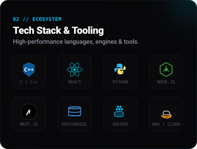
  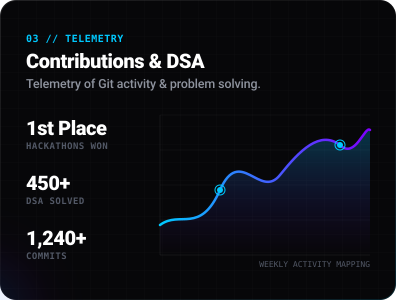
</p>

---

## 🚀 Featured Bento Projects

<table border="0" cellpadding="0" cellspacing="0" width="100%">
  <!-- Row 1 -->
  <tr>
    <td width="50%" align="center" valign="top">
      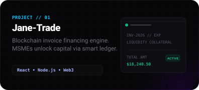
      <br/>
      <a href="https://github.com/Shar236/Jane-Trade" target="_blank">
        
      </a>
      <a href="https://github.com/Shar236/Jane-Trade" target="_blank">
        
      </a>
    </td>
    <td width="50%" align="center" valign="top">
      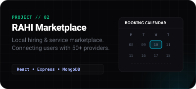
      <br/>
      <a href="https://github.com/Shar236/RAHI" target="_blank">
        
      </a>
      <a href="https://github.com/Shar236/RAHI" target="_blank">
        
      </a>
    </td>
  </tr>
  <tr><td colspan="2"><br/></td></tr>
  <!-- Row 2 -->
  <tr>
    <td width="50%" align="center" valign="top">
      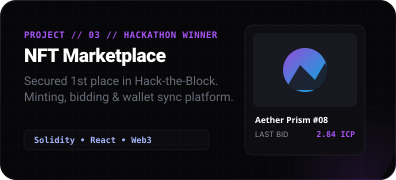
      <br/>
      <a href="https://github.com/Shar236/NFT-Marketplace" target="_blank">
        
      </a>
      <a href="https://github.com/Shar236/NFT-Marketplace" target="_blank">
        
      </a>
    </td>
    <td width="50%" align="center" valign="top">
      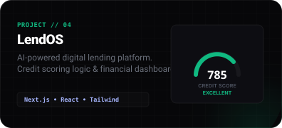
      <br/>
      <a href="https://github.com/Shar236/LendOS" target="_blank">
        
      </a>
      <a href="https://github.com/Shar236/LendOS" target="_blank">
        
      </a>
    </td>
  </tr>
  <tr><td colspan="2"><br/></td></tr>
  <!-- Row 3 -->
  <tr>
    <td width="50%" align="center" valign="top">
      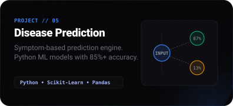
      <br/>
      <a href="https://github.com/Shar236/Disease-Prediction" target="_blank">
        
      </a>
      <a href="https://github.com/Shar236/Disease-Prediction" target="_blank">
        
      </a>
    </td>
    <td width="50%" align="center" valign="top">
      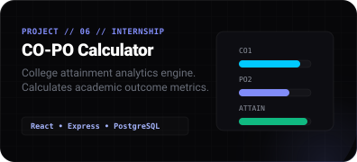
      <br/>
      <a href="https://github.com/Shar236/CO-PO_Attainment-Calculator" target="_blank">
        
      </a>
      <a href="https://github.com/Shar236/CO-PO_Attainment-Calculator" target="_blank">
        
      </a>
    </td>
  </tr>
</table>

---

## 📅 Developer Timeline

```text
┌───────┐
│ 2023  │  ✦ Started B.Tech in Computer Science
└───────┘  
    │
    ▼
┌───────┐
│ 2024  │  ✦ AI & Machine Learning Intern @ Solitaire Infosys
└───────┘  
    │
    ▼
┌───────┐
│ 2025  │  ✦ Secured 1st Place @ Hack-the-Block Hackathon
└───────┘  
    │
    ▼
┌───────┐
│ 2026  │  ✦ SDE Intern @ Blue Stock Fintech
└───────┘  
    │
    ▼
┌────────┐
│ Future │ ✦ Scaling Distributed Systems & SDE Engineering
└────────┘
```

---

## 🎯 Current Focus &amp; Core Learning

| Focus Area | Core Technologies | Target Objective |
| :--- | :--- | :--- |
| **Advanced C++** | C++20, STL, Template Metaprogramming | Low-latency algorithm design |
| **System Design** | Microservices, Load Balancers, Caching | Building high-availability platforms |
| **Distributed Systems** | Replication, Consensus, Partitioning | Mastering large scale computations |
| **Linux &amp; Cloud** | AWS (EC2, S3), Shell Scripting, Docker | Cloud-native engineering deployments |

---

## 🏆 Engineering Milestones

*   🥇 **Hack-the-Block Winner**: Secured 1st place among 50+ competing teams (ICP Blockchain Track).
*   🎖️ **Top 5 Finalist**: Placed in the top 5 at the IN University Hackathon.
*   💼 **Software Development Intern**: Engineered core platform features at Blue Stock Fintech.
*   🤖 **AI &amp; ML Intern**: Pre-processed 10k+ training logs and deployed prediction models at Solitaire Infosys.

---

## 📊 Developer Metrics &amp; Telemetry

<p align="center">
  
  
</p>

<p align="center">
  
</p>

<p align="center">
  
</p>

<p align="center">
  
</p>

<p align="center">
  
</p>

---

## 📬 Reach Out &amp; Collaborate

<p align="center">
  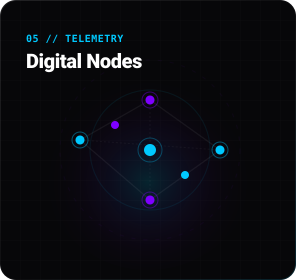
</p>

<p align="center">
  <a href="https://github.com/Shar236" target="_blank">
    
  </a>
  <a href="https://linkedin.com/in/sharvankumar236" target="_blank">
    
  </a>
  <a href="https://leetcode.com/u/Sharvan236" target="_blank">
    
  </a>
  <a href="mailto:sharvandev28@gmail.com">
    
  </a>
  <a href="https://twitter.com/sharvan_7x" target="_blank">
    
  </a>
  <a href="https://drive.google.com/file/d/1WEtPeBRyKEmal8WQlzG7b5R61D7IPs6r/view" target="_blank">
    
  </a>
  <a href="https://github.com/Shar236" target="_blank">
    
  </a>
</p>

---

<p align="center">
  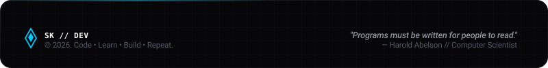
</p>
